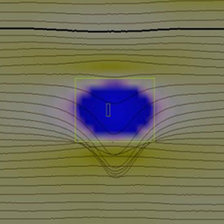

# Problem Introduction

To assess the health and integrity of their pipelines, operators regularly hire inspection companies to run specialized tools known as “pigs” through designated sections of pipe. These tools use various technologies and sensor arrays to detect and measure features in, on, and around the pipe wall.

Occasionally, and perhaps more often than the electrical and mechanical engineers would like to admit, these tools or their sensors fail during an inspection. Field technicians may not know that a failure occurred until the tool is returned and its data is processed. By then, tens or hundreds of miles of inspection data may have been collected and distributed for analysis.

Depending on the number of affected sensors, the type and duration of the failure, and the resulting loss of coverage, the inspection may be partially or entirely invalid. The pipeline may then need to be inspected again, resulting in substantial costs and delays.

In 2024, I was tasked with developing a method to detect these failures on-site, shortly after the tool is removed from the pipeline. This allows technicians to assess whether an inspection is likely to pass validation before leaving the site.

# Initial Investigation

To get started, I reached out to several to the leader of field services and the Manager of the Data Analyst teams for a list of runs which were known to contain failed sensors. Once I had a list of ~50 runs, I went through each run to make sure that the failed sensors were marked in a consistent manner. Some were marked from beginning to end, even though it only failed part way through, and there was no difference between a sensor that failed due to electrical noise, and a sensor that flatlined.

# Analysis and Solution

Because pipelines vary widely in diameter, coating, and wall thickness, the data had to be normalized if a single model was going to work across inspections. I standardized the signals using median-based scaling and used signal processing to extract features such as signal energy, peak spacing, and related characteristics. Even that was not sufficient, since every run has its own baseline and behavior; what looks like a dead or noisy sensor on one run may be entirely normal on another. To account for this, I added features that compared each sensor's measurements with the median sensor values at the same location.

The final solution evaluated the pipe in 40-foot segments, generated features for every sensor within each segment, compared those features against the sensor with the median value for each metric, and then used an XGBoost model to predict whether a sensor had failed. To reduce false positives, a section had to be flagged as failed in five consecutive snapshots before it was treated as an actual failure. During training, I held out entire runs for testing, since individual 40-foot sections from the same run were highly correlated.

# The Implementation

The implementation also needed to satisfy several technical constraints. It had to run quickly because field technicians and pipeline personnel could not wait hours for results. It also had to operate on the standard Lenovo ThinkPads issued to technicians, without relying on specialized hardware or cloud computing. Finally, each inspection generated billions of sensor readings, while individual tools varied in design and number of sensors. The method therefore needed to process large datasets efficiently while adapting to different tool configurations.

Although I performed the initial analysis and data collection in Python, deploying the solution required porting the pipeline and model to C++ so it could integrate efficiently with our existing infrastructure. Because the model was built with XGBoost, I configured its C++ API within our CMake environment and reimplemented the preprocessing and data collection pipeline in C++. While the model runtime is a function of many variables such as sensor count, sample rate and distance, this change from Python to C++ improved runs that would take over 12 hours to under 10 minutes.
